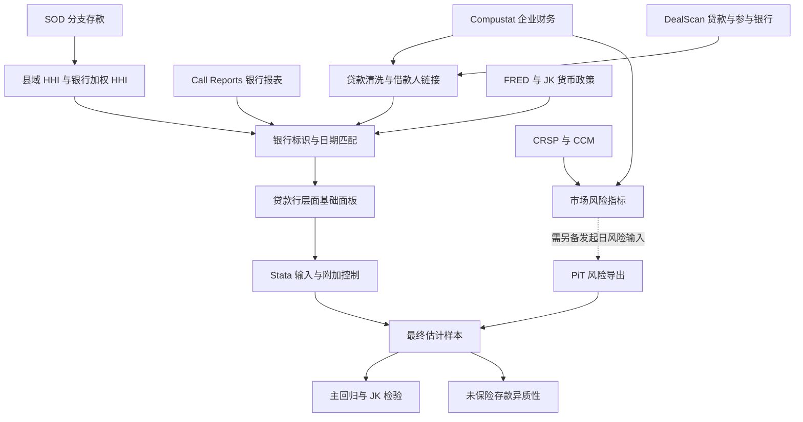

# 数据处理流程：从多源记录到估计样本

本文档解释程序之间的依赖，以及每一步为什么会影响经济解释。它描述选入仓库的代码，不表示附带数据或已经从原始数据库完整重跑。

## 1. 数据有不同的观察层级

一笔银团贷款可以包含多个 tranche，每个 tranche 又有多个贷款行。DealScan 的贷款行参与记录、企业季度财务数据、银行季度报表和银行年度存款指标并不处于同一层级。

因此，本项目首先区分合同特征、借款人特征与贷款行特征，再使用标识和日期合并。不能把同一 tranche 下的多家银行参与简单当作互不相关的独立贷款，也不能将原始参与记录数解释为借款企业数。

虚线处是当前代码归档的复现边界：季度风险计算与精确贷款发起日风险之间不是本仓库已经闭合的自动步骤。

## 2. 清洗四类基础数据

### 银行监管报表：`code/data/01_clean_fdic_call_reports.py`

程序分别读取 Call Reports 的不同组成表，先选择标识与所需字段，再处理日期、重复报送和合并。这样可以降低一次性合并所有原始字段的内存负担，也便于检查同一指标在不同报表口径中的来源。

随后构造银行资产、存款、贷款和资本等变量。季度存量指标与年初至今累计收入指标不能直接混用；程序中的字段换算和筛选应结合具体指标审核。输出保留在本地清洗目录。

### 分支机构存款：`code/data/02_clean_fdic_sod.py`

先按银行、县和年份汇总分支存款。令县 $c$ 中银行 $i$ 的存款为 $D_{ict}$，则：

$$HHI_{ct}=\sum_i\left(\frac{D_{ict}}{\sum_jD_{jct}}\right)^2.$$

再按一家银行在各县的存款分布构造：

$$HHI_{it}=\sum_c\frac{D_{ict}}{\sum_k D_{ikt}}HHI_{ct}.$$

这个指标衡量银行所处存款市场的集中度暴露，不等于该银行的全国市场份额。代码保留 HHI=1 的垄断县；当前清洗实现未启用注释中的年度缩尾操作，不能仅凭旧注释认定已缩尾。

### 贷款合同：`code/data/03_clean_dealscan.py`

原始清洗范围延伸到 2025 年，最终论文估计范围则截止 2024 年；二者并不矛盾。清洗程序整理合同日期、期限、金额、贷款行参与和利差字段，暂不在这一阶段完成最终的行业筛选与完整案例筛选。

同一字段可能同时保留原值、单位换算值和后续生成的截尾版本。哪些变量进入最终估计，应以 `.do` 文件实际读取的变量为准，而不是看到名称中有 `_t` 就推定所有变量采用相同处理。

### 企业财务：`code/data/04_clean_compustat.py`

程序清理季度财务记录，构造企业规模、杠杆、盈利和其他财务指标。银行、企业和贷款数据的金额单位并不天然一致，跨库计算前需要区分美元、千美元、百万美元及比例值。

## 3. 借款人与银行的跨库衔接

### 借款人匹配：`05_link_dealscan_compustat.py`

借款人标识优先使用 DealScan–Compustat 链接表，按 facility、borrowercompanyid、ticker、名称的层级补充匹配；冲突时按来源优先级与置信信息选择映射。名称匹配不应与高质量标识匹配视为等价。

匹配到 GVKEY 后，使用不晚于贷款日期、距离不超过365天的最近季度财务记录。这里的“不晚于”针对财务报告期；季度结束日不等于公开披露日，因此不能据此宣称所有输入均已满足严格的实时信息可得性。

### 贷款行匹配：`06_merge_four_tables.py`

将贷款行标识连接至 RSSD，处理外部链接表、有效年份和银行后继关系，再合并 Call Reports、SOD 与宏观数据。代码包含来源优先级、日期窗口和匹配审计字段。原有流程存在报表前向回退等处理，应将这些规则视为研究口径的一部分。

`07_verify_lender_bank_matching.py` 和 `08_manual_linking_audit.py` 分别检查映射与手工链接质量。匹配成功率并非唯一质量标准：高覆盖若来自错误匹配，可能比缺失观测造成更严重偏差。

## 4. 风险指标与发起日信息

`code/risk/09_download_wrds_market_inputs.py` 取得已授权的 CRSP/CCM 等输入；`10_merge_compustat_crsp_ccm.py` 衔接证券与企业标识；`11_build_bs2008_default_probability.py` 构造季度 Bharath–Shumway 简化违约风险指标。

该实现将股权价值与债务代理统一单位，使用股权波动率构造简化资产波动率，再将 distance to default 转为正态分布下的违约概率。它是模型隐含风险指标，不是已实现违约率。当前实现还使用季度股权价值的同比对数变化及滚动波动率，具体定义以代码为准。

为聚焦论文直接相关内容，归档版本去除了该文件中依赖其他研究文件的旧迭代模型比较与绘图段，保留风险计算与输出逻辑。

`14_export_pit_risk_sidecar.py` 读取已经存在的发起日风险文件，按 GVKEY 与贷款发起日期整理导出；它不是精确发起日风险的完整生成器。最终回归使用这一发起日输入，而不是直接把季度风险表当成同一文件。

## 5. 从基础面板到最终样本

`09_prepare_final_regression_panel.py` 构造基础研究面板；`40_build_lender_specific_spread_controls.py` 整理贷款行利差及相关辅助字段；`56_refresh_stata_inputs_from_final_panel.py` 生成 Stata 输入。

最终估计在 Stata 中继续执行美国借款人、非金融行业、广义牵头行、2001—2024 年和关键变量完整性的限制。固定效应估计还会改变实际使用样本，因此基础面板行数、筛选后行数和回归的 `e(N)` 必须分别理解。

## 6. 质量检查与解释

| 检查 | 目的 | 仍需注意 |
|---|---|---|
| 标识唯一性与重复键 | 防止合并导致行数膨胀 | 合同多银行参与可能是合法重复层级 |
| 匹配来源和覆盖 | 识别低质量补充链接 | 覆盖率不能证明映射正确 |
| 报告期与贷款日期 | 识别过期或前向信息 | 报告期不等于发布日期 |
| 金额及利差单位 | 避免千倍、百分比和bp换算错误 | fallback 字段需逐项核对 |
| 样本与缺失值 | 识别完整案例筛选造成的选择 | 缺失不等于零 |
| 固定效应后的观测数 | 对照最终论文结果 | 不同设定使用的样本可能不同 |

代码中的诊断输出写入本地工作区，仓库不附带逐条审计记录、匹配文件或数据集。
